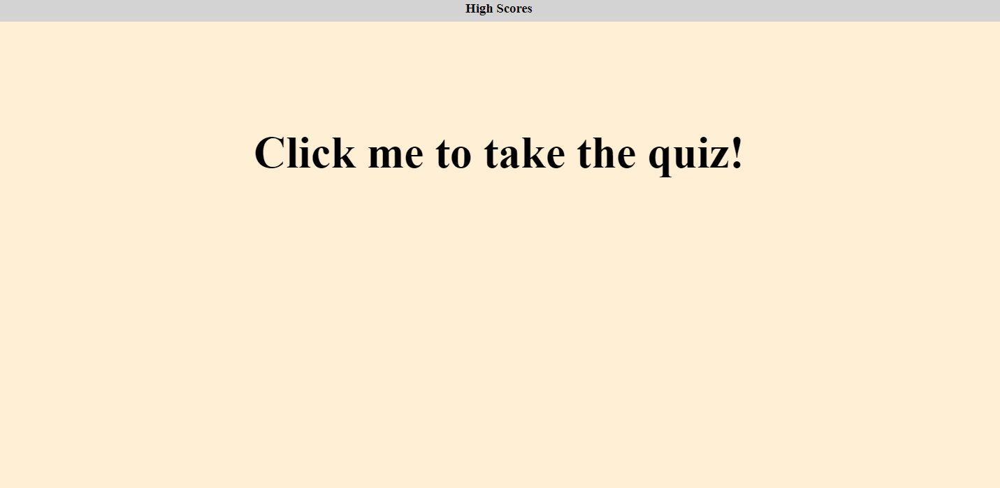

# Code-Quiz
A quick built code quiz built on JavaScript.
----------
Made with HTML, JS, and CSS.

Uses a variety of JS methods, including action listeners, randomization, DOM rendering, intervals, local storage, and HTML property management.

----------

----------

Try to answer all the questions before the time runs out.

----------

[link to project implementation](https://zacharyeggert.github.io/Code-Quiz/)